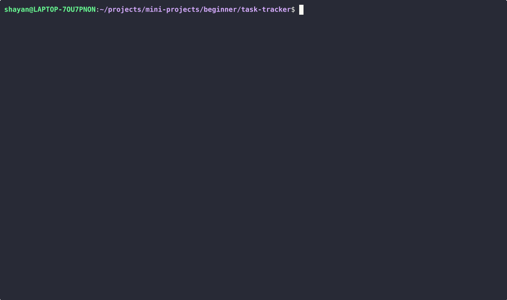

# Task Tracker

Source: [roadmap.sh/projects/task-tracker](https://roadmap.sh/projects/task-tracker)

A CLI app to create, update, and track tasks stored in a local JSON file. No external libraries -- just the language's native filesystem module.

## Demo



## Getting Started

Prerequisites: Python 3.10+

```bash
git clone https://github.com/<your-username>/mini-projects.git
cd mini-projects/beginner/task-tracker
python3 -m venv .venv
source .venv/bin/activate
pip install -r requirements.txt
python main.py
```

## Requirements

The app accepts user actions as positional CLI arguments. Tasks are persisted to a `tasks.json` file in the current directory, created automatically on first run.

Users must be able to:

- Add, update, and delete tasks
- Mark a task as in-progress or done
- List all tasks, or filter by status (`todo`, `in-progress`, `done`)

Constraints:

- No external libraries or frameworks
- Native filesystem module only for file operations
- Handle errors and edge cases gracefully

## Task Schema

| Property | Type | Description |
|----------|------|-------------|
| `id` | number | Unique identifier |
| `description` | string | Short description of the task |
| `status` | string | `todo`, `in-progress`, or `done` |
| `created_at` | datetime | Timestamp when the task was created |
| `updated_at` | datetime | Timestamp when the task was last updated |

## Commands

```bash
# Add a task
python main.py add "Buy groceries"
# Output: Task added successfully (ID: 1)

# Update and delete
python main.py update 1 "Buy groceries and cook dinner"
python main.py delete 1

# Change status
python main.py mark-in-progress 1
python main.py mark-done 1

# List tasks
python main.py list
python main.py list todo
python main.py list in-progress
python main.py list done
```